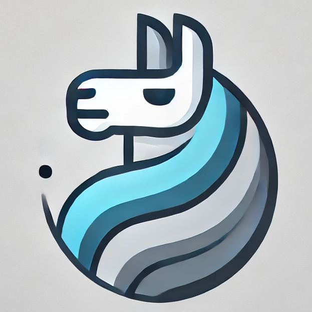
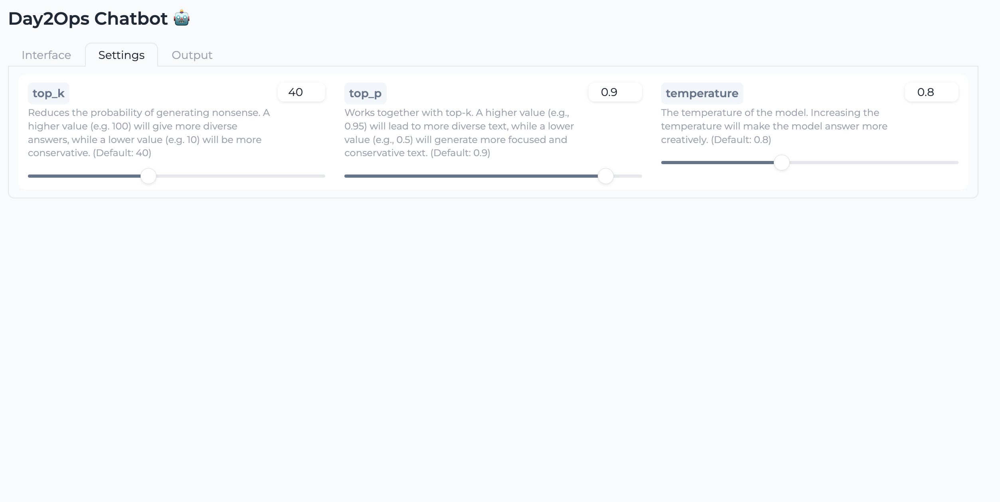
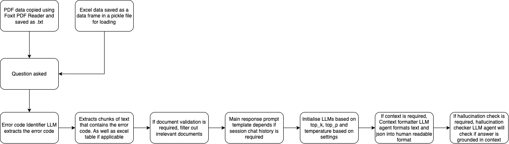

# RAG-LLM


## Table of Contents
- [Introduction](#introduction)
- [Features](#features)
- [Installation](#installation)
- [Usage](#usage)
- [Docker Setup](#docker-setup)
- [Demo](#demo)
- [How it works (A high level overview)](#how-it-works-a-high-level-overview)
- [To do list](#to-do-list)
- [Contact](#contact)

## Introduction
Welcome to **RAG-LLM**! This project aims to consolidate error code documentation and have a chatbot interface to answer any queries regarding the error codes. However due to the nature of the setup, queries can be slow! 

## Features
- 🚀 **Feature 1**: You can chat with it and ask about any error codes. You can enable session chat history (but takes longer for every additional query)
- 🎨 **Feature 2**: Shows the context (original content) that was used to answer your query. Shows the table and PDF page.
- 🔧 **Feature 3**: Settings tab for you to fine tune the LLM according to your use case (top_k, top_p, temperature).
- 🌐 **Feature 4**: Able to check validity of documents, quality of answers and for LLM hallucination.

## Installation
To get started, follow these steps:

1. Clone the repository:
   ```sh
   gh repo clone kaenugget/RAG-LLM-demo
   ```

2. Create a virtual environment:
   ```sh
   python3 -m venv venv
   source venv/bin/activate  
   # On Windows use `venv\Scripts\activate`
   ```

3. Install the required dependencies:
   ```sh
   pip install -r requirements.txt
   ```

## Usage
After installation, if you want to run it over docker, follow the [Docker Setup](#docker-setup) below.

Else if you wanto run it locally:

1. Install [Ollama](https://ollama.com/download)
   - Increase LLM request concurrency limit by running these in terminal:
   ```sh
   launchctl setenv OLLAMA_NUM_PARALLEL 14
   ```
   - Check the if it has been set:
   ```sh
   launchctl getenv OLLAMA_NUM_PARALLEL
   ```

   - restart your ollama service by using the app, or quitting and running the app again

2. Got to main.py
    - Uncomment out line 20
    ```sh
    ollama_host = os.getenv("OLLAMA_HOST", "localhost") #enable if you want to run locally and not on docker
    ```

    - Comment out line 21
    ```sh
    # ollama_host = os.getenv("OLLAMA_HOST", "ollama-container")
    ```

   - Run localstack to simulate AWS S3 service (have to install and setup localstack first, and upload your documents there)
   ```sh
   localstack start
   ```
   Run in another terminal:
   ```sh
   aws s3 mb s3://my-first-bucket --endpoint-url=http://localhost:4566
   ```

3. Run the application
    ```sh
    python main.py
    ```

## Docker Setup
To set up and run the application using Docker and Docker Compose, follow these steps:
<br>(if you ran it locally before, remember to revert back your changes done in step 2 of [Usage](#usage))<br>

1. Build and start the containers:
   ```sh
   docker-compose up --build
   ```
   - You would need to turn off cloudflare as there will be a SSL error!
   - Dont worry if you face this error, this is because the llama3 LLM takes awhile to pull: 
   <br>```"Ollama call failed with status code 404. Maybe your model is not found and you should pull the model with `ollama pull llama3`."```

2. To stop the containers:
   ```sh
   docker-compose down
   ```

## Demo
Here are some videos and screenshots of **rag-llm** in action:
<br>*disclaimer these are gifs and are sped up heavily<br>




## How it works (A high level overview)


## To do list
- [X] Implement proper working chatbot interface
- [X] Ingest error codes PDF / txt
- [X] Ingest excel file with business logic
- [X] Setup upload of .txt files to aws
- [X] Setup upload of .xlsx files and converting to .pkl before uploading to aws
- [X] Setup upload of image files of pdf to aws
- [X] Implement Error code identifier LLM agent
- [X] Extract chunks of text from .txt files relevant to the error codes
- [X] Implement document validation LLM agent
- [X] Implement session chat history 
- [X] Implement chat processing status 
- [X] Implement main response question-answering LLM agent
- [X] Implement settings tab to change top_k, top_p and temperature of main LLM agent
- [X] Implement context formatter LLM agent to return context in a nice human readable format
- [X] Implement hallucination checker LLM agent to check answer for hallucination
- [X] Fix document validation logic
- [X] Change hallucination checker agent output response
- [X] Show relevant PDF Page based on question
- [X] Show relevant Excel Table based on question
- [X] Fix excel table out of chatbot width, unable to side scroll
- [X] Implement Answer grader agent logic
- [X] Decouple DB with main container using aws S3
- [X] Reduce number of containers with multi-stage builds
- [X] Include unit tests
- [X] Use local stack and boto3 to integrate with AWS
- [X] Implement parallel processing such as using threadpool etc.
- [ ] Add password
- [ ] Add user accounts? (not adding due to cost and DB requirements and constraints)
- [ ] Add more LLM models
- [ ] Add more languages
- [X] Add XOM/JSON and general enquiry analysis

## Contact
If you have any questions or feedback, feel free to reach out to me on email or on slack!
- **Kaelan Wan**: [kaelan.wan.2022@scis.smu.edu.sg](mailto:kaelan.wan.2022@scis.smu.edu.sg)
